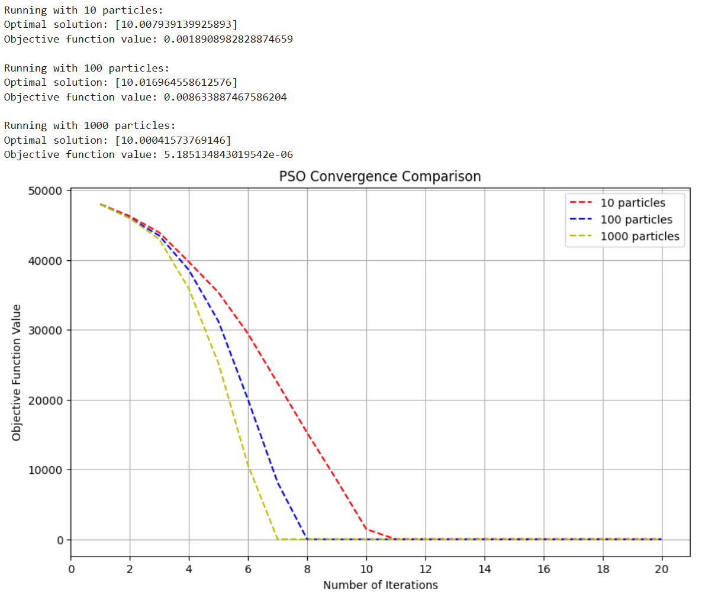

# 🌟 PSO-Continuous-Benchmark


> 🚀 A Python implementation of Particle Swarm Optimization for Continuous Benchmark Problems

## 📖 Overview

PSO-CBench is an elegant implementation of Particle Swarm Optimization algorithm designed for solving continuous optimization problems. The project features comparative analysis of different swarm sizes and provides beautiful visualizations of the convergence process.

## ✨ Features

- 🔋 Simple and efficient PSO implementation
- 📊 Multiple swarm size comparisons (10, 100, 1000 particles)
- 📈 Real-time convergence visualization
- 🎯 Continuous benchmark problem solving
- 🛠️ Easy-to-modify parameters

## 🚀 Quick Start

```bash
# Clone the repository
git clone https://github.com/moskanoro/PSO-Continuous-Benchmark.git

## 📋 Requirements

```txt
numpy>=1.19.2
matplotlib>=3.3.2
```

## 🎮 Usage

```python
from pso_benchmark import PSO, objective_function

# Run PSO with different swarm sizes
PSO(objective_function, bounds=[-100, 100], particle_size=100, iterations=20)
```

## 📊 Results

The algorithm compares performance across different swarm sizes:

| Swarm Size | Convergence Speed | Solution Quality |
|------------|------------------|------------------|
| 10         | Moderate         | Good            |
| 100        | Fast            | Better          |
| 1000       | Very Fast       | Best            |

## 📈 Visualization


*Convergence comparison of different swarm sizes*

## 👥 Author

- **MOSTAPHA BOUDAD** - *Initial work* - MOSKANORO

## 📜 License

This project is licensed under the MIT License - see the [LICENSE](LICENSE) file for details

---
<p align="center">
  <i>Don't forget to leave a ⭐ if you found this useful!</i>
</p>
